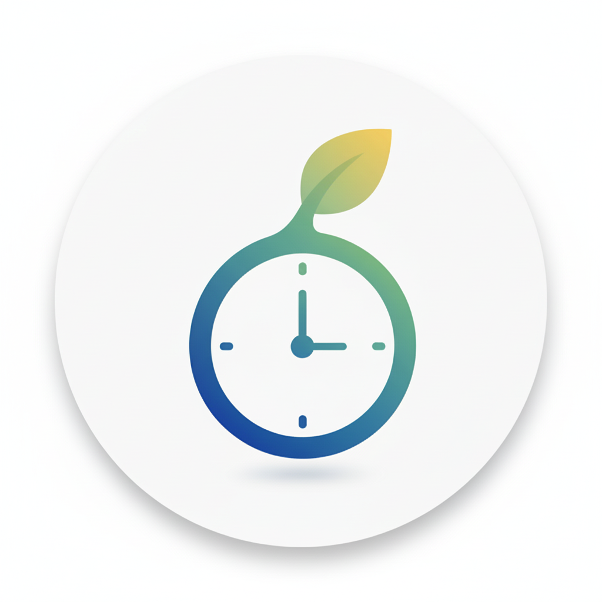

# MyTime — 专注效率 App

<p align="center">
  
</p>

<p align="center">
  一款面向学生 & 职场人的全能效率工具：专注计时、日程管理、课表导入、专注排行榜，并内置 AI 助手。
  <br/>
  <em>A full-featured productivity app for students &amp; professionals: focus timer, schedule management, course import, leaderboard, and AI assistant.</em>
</p>

<p align="center">
  
  
  
  
</p>

---

## 功能特性 / Features

| 模块 | 说明 |
|------|------|
| ⏱ **专注计时器** | 圆形滑块调节时长，动态动画展示专注状态，支持静音/主题切换 |
| 📅 **日程管理** | 列表 / 时间轴双视图，任务 & 课程管理，截止日期模式 |
| 🤖 **AI 助手** | 对话式 AI 一键添加任务，自然语言理解（基于 DeepSeek） |
| 📷 **课表图片导入** | 拍照 / 相册选图，AI 自动解析课表（Baidu OCR + DeepSeek） |
| 🏆 **专注排行榜** | 今日 / 累计专注时长实时排名，激励社区共同进步 |
| 🏫 **校园浏览器** | 内置 WebView 浏览器，支持书签和 AI 对话 |
| 👤 **个人中心** | 专注统计图表（今日时段分布、本周趋势）、用户名编辑 |
| 🌓 **深色 / 浅色主题** | 系统跟随，亦可手动切换 |

---

## 技术栈 / Tech Stack

**Frontend**
- [Expo](https://expo.dev) 54 + [React Native](https://reactnative.dev) 0.81 + TypeScript
- [Expo Router](https://expo.github.io/router/) (文件路由)
- [Zustand](https://github.com/pmndrs/zustand) (状态管理)
- [Supabase](https://supabase.com) (认证 & 云数据库)
- [React Native Reanimated](https://docs.swmansion.com/react-native-reanimated/) (动画)
- [react-native-gifted-charts](https://github.com/Abhinandan-Kushwaha/react-native-gifted-charts) (图表)

**Backend** (`/backend`)
- Node.js + Express
- SQLite3 (本地数据库)
- DeepSeek API (AI 对话)
- Baidu OCR API (图片文字识别)

---

## 快速开始 / Getting Started

### 前置条件 / Prerequisites

- Node.js >= 18
- [Expo CLI](https://docs.expo.dev/get-started/installation/)
- 一个 [Supabase](https://supabase.com) 项目（免费套餐即可）
- （可选）DeepSeek API Key 和 Baidu AI API Key（用于 AI 功能）

### 1. 克隆 & 安装 / Clone & Install

```bash
git clone https://github.com/MengPaul07/my-time-app.git
cd my-time-app
npm install
```

### 2. 配置环境变量 / Configure Environment Variables

```bash
cp .env.example .env
```

编辑 `.env`，填入你自己的 Supabase URL、Anon Key，以及可选的 AI API Key：

```env
EXPO_PUBLIC_SUPABASE_URL=https://your-project-id.supabase.co
EXPO_PUBLIC_SUPABASE_ANON_KEY=your-supabase-anon-key

# 可选，AI 功能需要
EXPO_PUBLIC_DEEPSEEK_API_KEY=your-deepseek-api-key
EXPO_PUBLIC_BAIDU_API_KEY=your-baidu-api-key
EXPO_PUBLIC_BAIDU_SECRET_KEY=your-baidu-secret-key
```

> 所有环境变量说明见 [.env.example](.env.example)

### 3. 初始化 Supabase 数据库 / Initialize Supabase Database

在 Supabase SQL Editor 中运行 `supabase_setup.sql` 来创建所需的表和策略。

### 4. 启动应用 / Start the App

```bash
npx expo start
```

扫码用 [Expo Go](https://expo.dev/go) 预览，或在模拟器中运行：

```bash
npx expo run:android   # Android
npx expo run:ios       # iOS (macOS required)
```

### 5. 启动后端（可选）/ Start the Backend (Optional)

AI 助手和 OCR 课表导入功能依赖本地后端服务：

```bash
cd backend
cp .env.example .env   # 填写 DEEPSEEK_API_KEY 等
npm install
npm run dev
```

---

## 项目结构 / Project Structure

```
my-time-app/
├── app/                  # Expo Router 页面
│   └── (tabs)/           # 底部 Tab 各页面
├── components/           # 通用 UI 组件
├── modules/              # 功能模块（timer、schedule、ai、auth…）
├── contexts/             # React Context（主题等）
├── hooks/                # 通用自定义 Hooks
├── utils/                # 工具函数（supabase 客户端、deepseek…）
├── types/                # TypeScript 类型定义
├── assets/               # 图片、字体等静态资源
├── backend/              # Express 后端
│   ├── controllers/      # 路由控制器
│   ├── db/               # SQLite 初始化
│   ├── utils/            # AI / OCR 调用工具
│   └── index.js          # 入口文件
└── supabase_setup.sql    # Supabase 数据库建表脚本
```

---

## 贡献指南 / Contributing

欢迎提交 Issue 和 Pull Request！请先阅读 [CONTRIBUTING.md](CONTRIBUTING.md)。

---

## 许可证 / License

[MIT](LICENSE) © 2025 MengPaul
